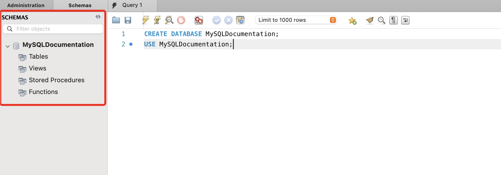
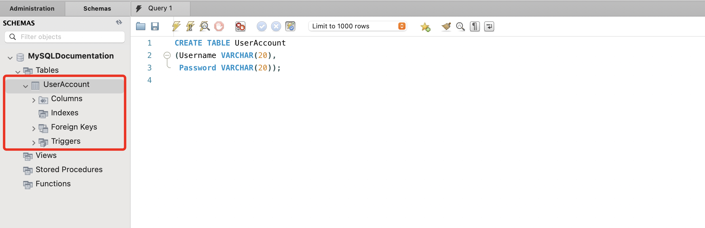
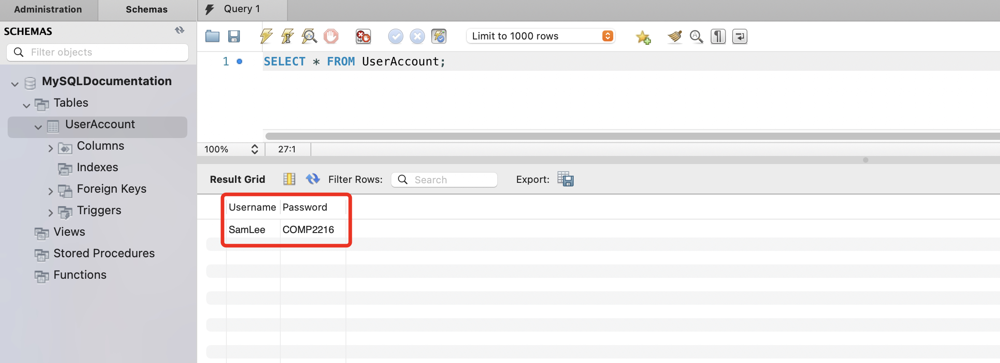
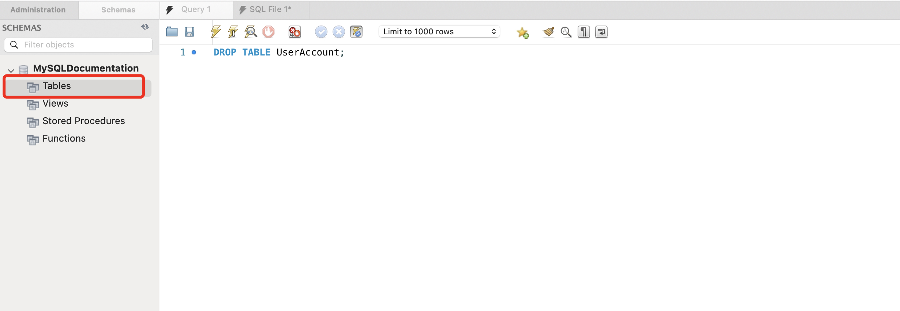

# Manage a TABLE

## Overview
SQL is the most commonly used programming language when managing relational database. In relational databases, all data are organized into tables, which are structured collections of rows and columns. Therefore, it is important to first learn the basis of how to manage relational databases, which includes tasks such as creating, inserting, deleting, and dropping tables.

## Set up a database
Before getting started, we will need to create a database to store tables.

1. Open MySQL WorkBench.

2. Connect to a MySQL server.

3. Open a new query tab under 'File' and then click on 'New Query Tab'.

4. To create a new database, execute the following code in the query window. 

    ``` sql
    CREATE DATABASE <DatabaseName>;    
    ```

    > ```CREATE DATABASE``` intializes a new database in the SQL server.

5. Click the refresh button to see your database appear on the schema pane:

    !!! success
        { align=left }


6. After creating the database, specify you want to use that database by running the following command:
``` sql
USE <DatabaseName>;
```

    > The ```USE``` statement selects an existing database and directs the following SQL queries to operate within that database. 
      
    After running this query, you should see a green checkmark in the action output. *Moving forward, every successful query should return a green checkmark:*
    !!! success
        
        
    

## Create a table
Once you have created a database, you can create and put a new table inside the database. 

1. Run the command below to create a table:
``` sql
CREATE TABLE <TableName>        
(<ColumnName> DATATYPE,         
 <ColumnName> DATATYPE,         
 <ColumnName> DATATYPE, ...);
```

    > The ```CREATE TABLE``` command creates a new table in a relational database. 

2. Click the refresh button to see your new table under your database in the schema pane:

    !!! success
        

## Insert a tuple into a table
After creating a table, you can populate the table with data.

1. Run the following command to insert a tuple into a table:
``` sql
INSERT INTO <TableName> (<ColumnName1>, <ColumnName2>, <ColumnName3>, ...) 
VALUES (<Value1>, <Value2>, <Value3>, ...); 
```

    > The ```INSERT INTO``` command is used to specify the name of the table you are inserting into. 
    
    > ```VALUES``` specifies the list of values that corresponding to the respective columns listed above.

    !!! note
        Make sure you insert values into the columns with the correct datatype.

2. Verify that the insertion was made correctly by running the command below. *We will refer to this step many times for verifying that the correct changes have been made*:

    ``` sql
    SELECT * FROM <TableName>;
    ```

    > The ```SELECT``` command chooses which columns to include in the returned table. 
    
    > The ```*``` symbol means to include all records. 
    
    > ```FROM``` command tells SQL which table to query from.


    At this point, you should see your table similar to the example below:

    !!! success
        

## Update a table record
1. In the scenario that you wish to make a change to a record, you can run the following command:
``` sql
UPDATE <TableName>
SET <ColumnName> = <New Value>, ...
WHERE <ColumnName> = <Value>;
```

    > The ```UPDATE``` keyword indicates that you would like to make changes to an existing table. 
    
    > The ```SET``` keyword specifies which column you wish to change. 
    
    > The ```WHERE``` keyword is used to extract only the records that fulfill the specified condition.

    !!!note
        If you encounter an error Error code 1175, disable safe update mode by referring to the troubleshoot guide.

2. Verify that the correct update was made by running the same command in [step 2](task1.md#insert-a-tuple-into-a-table) of 'Insert a tuple into a table'. You should see the new changes in the updated table:

    !!! success
        

## Delete a table record

1. In order to delete a table record, run the following command.
``` sql
DELETE FROM <TableName>
WHERE <condition>;
```

    > The ```DELETE FROM``` keyword specifies which table you would like to delete records from. 
    
    > The ```WHERE``` clause specifies the conditions that must be met before the record is deleted.

    !!! warning
        If you use the DELETE FROM clause without using in junction with the WHERE clause, all the rows in the table will be deleted.

2. Verify the correct deletion was made by running the same command in [step 2](task1.md#insert-a-tuple-into-a-table) of 'Insert a tuple into a table'. You should see that the record has been deleted:


    !!! success
        


## Drop a SQL table
Finally, We will go over how to drop an entire SQL table. 

1. Run the following command to drop an entire table:
``` sql
DROP TABLE <TableName>;
```

    > The ```DROP TABLE``` keyword specifies which table you would like to drop.

    You should see the table disappear from the schema pane when it is successfully dropped:
    !!! success
        


## Conclusion
By the end of this section, you will have learned the following:

- [x] Understanding what SQL is and how its applied
- [x] Setting up a database
- [x] Creating a SQL table
- [x] Inserting a tuple into a table
- [x] Updating a table record
- [x] Deleting a table record
- [x] Dropping SQL table

