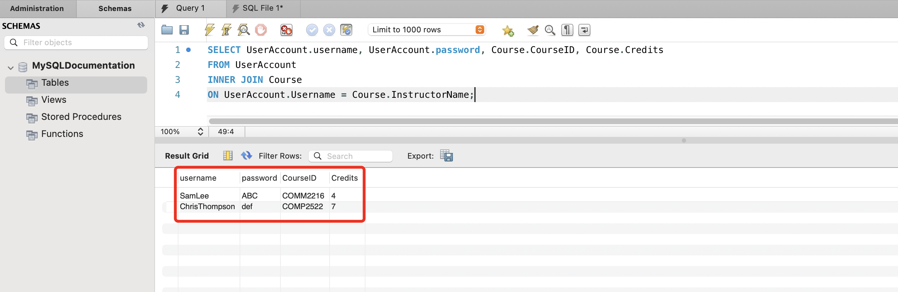
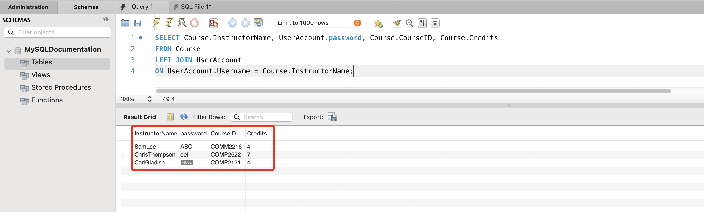
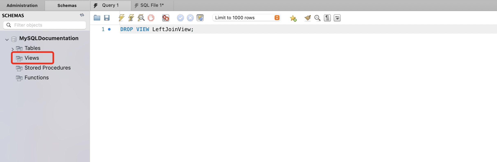

# Join tables into a VIEW


## Overview
Understanding how to join tables is crucial for effectively managing a relational database where data resides across multiple tables. A view in a database serves as a virtual table, formed by a query that selects data from multiple sources. This virtual table can be saved for future reference, making views invaluable for data analysis and reporting by providing access to combined data without the need for data duplication.


## Set up tables for joining
Before getting started, ensure that the tables we plan on joining are all created. 

1. Follow instructions in [Create a TABLE](task1.md#create-a-table){:target="_blank"} to create some tables and insert data into them.

    !!! note
        We need **at least two**  tables, each with at least one column that relates to the other table.


## Combine multiple tables
After preparing multiple tables for joining, you need to decide how to join them. We will cover two of the most common types of SQL joins, **INNER JOIN** and **LEFT JOIN**.

### INNER JOIN
1. Execute the command below to perform inner join on two tables.
    ``` sql
    SELECT <TableName1>.<ColumnName>, <TableName2>.<ColumnName>, ...  
    FROM <TableName1>
    INNER JOIN <TableName2>
    ON <TableName1>.<CommonColumnName> = <TableName2>.<CommonColumnName>, ...;
    ```

    !!! note
        Within the ```ON``` clause, the `<CommonColumnName>` in the two tables should represent the same data.

    At this point, you should see the combined table in the output box. 
    !!! success
        

2. Verify that the combined table was merged correctly by cross checking the result. 

    > The row count in the combined table should only contain rows where there is a match in both tables. Additionally, confirm that all desired columns are present in the combined table.


### LEFT JOIN
1. Execute the command below to perform inner join on two tables.
    ``` sql
    SELECT <TableName1>.<ColumnName>, <TableName2>.<ColumnName>, ...    
    FROM <TableName1>
    LEFT JOIN <TableName2>
    ON <TableName1>.<CommonColumnName> = <TableName2>.<CommonColumnName>, ...;
    ```

    !!! note
        Within the ```ON``` clause, the `<CommonColumnName>` in the two tables should represent the same data.

    At this point, you should see the combined table in the output box. 

    !!! success
        


2. Verify that the combined table was merged correctly by cross checking the result. 

    > The row count in the combined table should match the total rows in table `<TableName1>`. Additionally, confirm that all desired columns are present in the combined table.

## Create a view
After you combined data from multiple tables, you will need to create a view for the combined data for future reference. 

1. Execute the command below to create a view.
    ``` sql
    CREATE VIEW <ViewName> 
    AS <Query>;                     
    ```

    >In the command provided, replace `<Query>` with the join query you wrote in the previous step (either the [INNER JOIN](#inner-join) or the [LEFT JOIN](#left-join)). 

2. Verify that the correct table was made by running the following command. 
    ``` sql
    SELECT * FROM <ViewName>;       
    ```

    > Make sure the query results match those from the join query in the [Combine multiple tables](#combine-multiple-tables) section.

    !!! success
        

3. Follow instructions in [Update a table record](task1.md#update-a-table-record){:target="_blank"} to update a record in one of the original tables. 

4. Refer to step 2 in this section to verify that the view's content has indeed been updated to mirror the changes made to the original table.

    > Observe how the view automatically updates to reflect these changes, showcasing its dynamic connection to the source data.

    !!! success
        


## Drop a view
Finally, We will go over how to drop the view. 

1. Run the following command to drop the view in database.
    ``` sql
    DROP VIEW <ViewName>;
    ```

    !!! success
        


## Conclusion
By the end of this section, you have gained knowledge on the following tasks:

- [x] Understanding the purpose and utility of joining tables
- [x] Creating a view from joined tables
- [x] Combining two tables with "INNER JOIN"
- [x] Comining two tables with "LEFT JOIN"
- [x] Dropping a view
