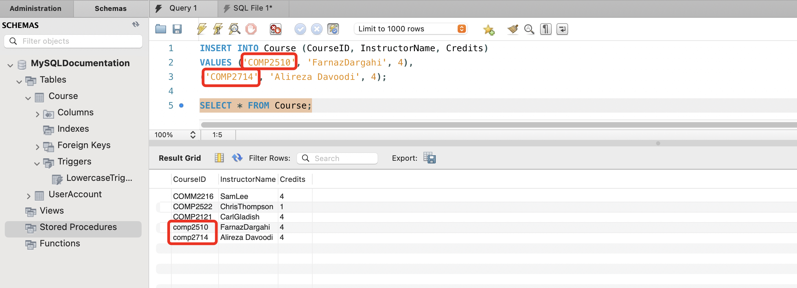
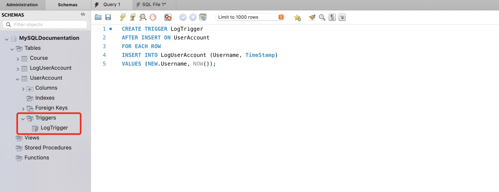
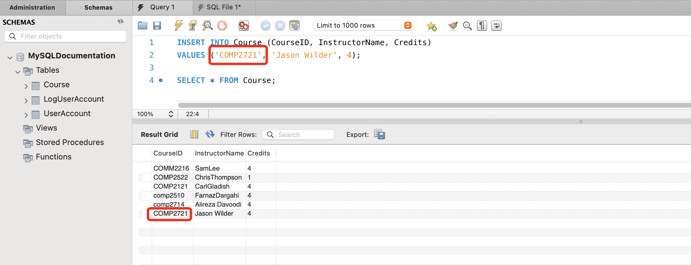

# Create and drop a TRIGGER

## Overview
Triggers are special types of stored procedures that automatically executes or fires in response to certain events on a table or view in a database. Understanding how to create and manage triggers is essential for implementing complex business logic directly on the database level to ensure data integrity. It is also used to automate tasks such as auditing changes, enforcing constraints, or updating related tables. 


## Set up tables for adding a trigger
Before you create a trigger, it is important to set up your tables properly.

1. Follow instructions in [Create a TABLE](task1.md#create-a-table){:target="_blank"} to create some tables and insert data into them.


## Create a trigger
Creating a trigger involves specifying the timing (`BEFORE` or `AFTER` the event), the event (`INSERT`, `UPDATE`, or `DELETE`) that triggers it, and the operations to be performed. We will cover two of the most common types of SQL triggers: **BEFORE INSERT** and **AFTER INSERT**.

### BEFORE INSERT
The BEFORE INSERT trigger is set up to automatically run special checks or tasks right before a new entry is added to a database table. This ensures that any data being added follows specific rules we've set in the trigger, maintaining consistency and quality.

1. Execute the command below to create a trigger:
    ``` sql
    CREATE TRIGGER <TriggerName>
    BEFORE INSERT ON <TableName>
    FOR EACH ROW
    -- Trigger logic goes here
    ```
    An example of the ```Trigger logic``` could be:
    ``` sql
    SET NEW.<ColumnName> = LOWER(NEW.<ColumnName>);
    ```
    The `CREATE TRIGGER` command establishes a new trigger, which is a set of actions executed automatically in response to specific events on a table or view in the database. 

    The `BEFORE INSERT` keyword specifies that the trigger actions should be executed before a new record is inserted into the table.

    The `FOR EACH ROW` clause indicates that the trigger should operate on each row affected by the triggering event individually.

    The `SET` command within a trigger or SQL statement assigns a new value to a specified column or variable.

    The `NEW` keyword in a trigger context refers to the version of a row that contains the new values for an insert or update operation, allowing triggers to access or modify these new values.

    The `LOWER` function converts all characters in a specified string to lowercase, useful for standardizing text data before storage or comparison.

    !!! success
        

2. Verify the trigger by performing the action it is designed to respond to.

    For example, after setting up a `BEFORE INSERT` trigger which converts a column's data to lowercase before insertion, you can test the trigger's functionality by attempting to insert a record into the designated table using uppercase letters in the targeted column. Execute the following command to observe the trigger in action:
    ``` sql
    INSERT INTO <TableName> (<ColumnName>, ...)
    VALUES ('UPPERCASE Value', ...);
    ```

3. Verify that the correct data has been inserted by running the following command for the table updated in step 2:
    ``` sql
    SELECT * FROM <TableName>;
    ```

    !!! success
        

### AFTER INSERT
The AFTER INSERT trigger is designed to perform certain actions or validations right after a new entry has been successfully added to a database table. This allows for further processing of the newly inserted data, such as updating related records or logging changes, ensuring that our data handling meets established criteria.

1. Execute the command below to create a trigger:
    ``` sql
    CREATE TRIGGER <TriggerName>
    AFTER INSERT ON <TableName>
    FOR EACH ROW
    -- Trigger logic goes here

    ```

    An example of trigger logic could be:
    ``` sql
    INSERT INTO <LogTableName> (<ForeignKeyColumn>, <TimestampColumn>)
    VALUES (NEW.<ForeignKeyValue>, NOW());
    ```
    The `AFTER INSERT` keyword specifies that the trigger actions should occur after a new record is successfully inserted into the table.

    !!! note
        For this example, ensure you have created a log table named `<LogTableName>` alongside your main table `<TableName>`. For guidance on creating a new table, please refer to [Create a TABLE](task1.md#create-a-table){:target="_blank"}.


    !!! success
        

2. Verify the trigger by performing the action it is designed to respond to.

    For example, after setting up a `AFTER INSERT` trigger which logs a record in the log table after insertion, you can test the trigger's functionality by attempting to insert a record into the designated table and note the change in the log table. Execute the following command to observe the trigger in action:
    ``` sql
    INSERT INTO <TableName> (<ColumnName>, ...)
    VALUES ('anything', ...);
    ```

3. Verify that a log record has been created successfully by running the following command for the log table:
    ``` sql
    SELECT * FROM <LogTableName>;
    ```

    !!! success
        

## Drop a trigger
Finally, We will go over how to drop the trigger. 

1. Execute the following command to drop the trigger in database:
    ``` sql
    DROP TRIGGER <TriggerName>;
    ```
    The `DROP TRIGGER` statement is used to delete an existing trigger from the database, removing its definition and associated actions.

    !!! success
        


2. Repeat step 2 and 3 from [BEFORE INSERT](#before-insert) or [AFTER INSERT](#after-insert) to verify if trigger has been dropped.

    !!! success
        

## Conclusion
By the end of this section, you have gained knowledge on the following tasks:

- [x] Understanding the purpose and functionality of triggers
- [x] Creating BEFORE INSERT triggers
- [x] Creating AFTER INSERT triggers
- [x] Dropping triggers
